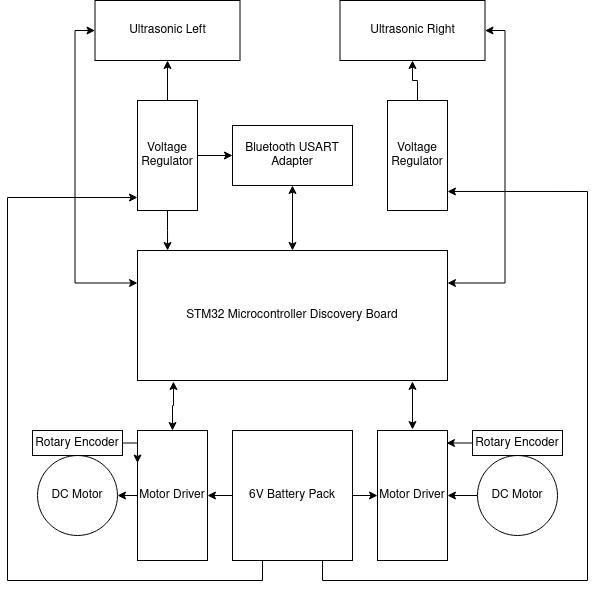
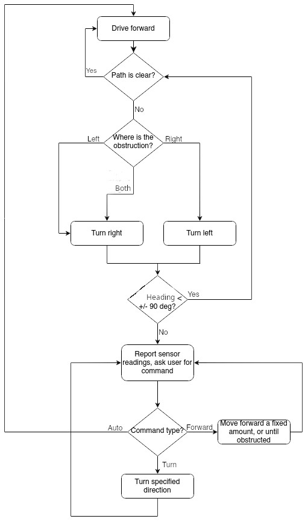

# Embedded Systems Final Project
lightcyan team for University of Utah's ECE 5780 final project.

## Team Members
* Ella Moss
* Ryan Lam
* Matt Alter

## Purpose
The purpose of this project is to create a controllable robot that can navigate an obstacle course without running into any objects.

## Basic Setup
1. Print the chassis linked in the Bill of Materials at 80%, or similar. If using the linked chassis, also print the motor holder.
2. Mount the battery pack behind the motor holders, this will hang over the back edge of the robot.
3. Using a breadboard on the front, mount the two ultrasonic sensors on the left and right sides of the breadboard, and the bluetooth adaptor in the center.
4. Connect the battery pack to one set of power and ground rails, and use a voltage divider to connect the other rail.
5. Wire the components as shown in the Documentation.
6. 

## Usage
To successfully navigate an obstacle course, several UART commands have been implemented -- listed under [Commands](Commands.md).

Users may implement any algorithm for course navigation. Users should use the "Log" command ('l') frequently to check that heading, distance, and ultrasonic data are their expected values.

Values logged are in centimeters for distances and degrees for angles. The rover will automatically stop when an object is 20cm away from an object, at which point the user should turn left or right, then check if the path is clear yet. If two obstacles are next to each other, the user may need to check both left and right before making a decision about how to evade the obstacle. Once the robot is angled toward a path that is clear, continue on that path for a short distance (e.g. 20cm, with the "w1" command). Then, return to 0-degree heading and continue while clear ("w0").

## Bills of Materials
This section provides a list of materials, part numbers, and costs associated with the project.

| Description | Vendor | Part Number | Qty | Total Cost |
|-------------|--------|-------------|-----|------------|
| 3D Printed Chassis | Thingiverse | - | 1 | - |
| 6V Brushed DC Motor | Adafruit | 4638 | 2 | $25.00 |
| Motor Controllers | OSHPark | N/A | 2 | $15.00 |
| Wheel Kit for Motors | Pololu | 1087 | 1 | $3.95 |
| 16mm Caster Wheel | Adafruit | 3949 | 1 | $1.95 |
| STM32F072 Discovery Board | MEB Stockroom | STM32F072B-DISCO | 1 | $12.00 |
| Bluetooth Adapter | ProtoSupplies | ZS-040 | 1 | $11.95 |
| Battery Pack | Adafruit | 3859 | 1 | $2.95 |
| Ultrasonic Sensor | Adafruit | 3942 | 3 | $11.85 |
| Force Sensor | Adafruit | 1075 | 3 | $17.85 |
| Voltage Regulator | Wolfwhoop | 5824093032 | 2 | $12.89 |
| | | | **Total:** | **$115.39** |

Additionally, this table lists components required for assembling the motor driver. These component prices vary, but the total tends to be under $10.

| Part     | Manufacturer Short Description | Manufacturer Part # | Qty |
| ----     | ------------------------------ | ------------------- | --- |
| C1       | polarized cap - 1uF            | PREA010M2CBK-0511P  | 1   |
| C2-C4    | ceramic cap - 100nF            | C1206C104K5RAC7800  | 3   |
| R1,R3,R4 | resistor - 10k                 | RC1206JR-0710KLY    | 4   |
| R2       | current sense resistor - 0.04  | RL1206FR-070R04LY   | 1   |
| U5-U8    | diode DO-214AC SMA             | RS2AA R3G           | 4   |
| U1       | dual full bridge motor driver  | L298N               | 1   |
| U2       | digital (I2C) temp sensor      | LM75AIMX/NOPB       | 1   |
| J1-J3, J5| generic pin header             | 68001-121HLF        | 21  |
| J4       | DC power jack                  | CON-SOCJ-2155       | 1   |

## Documentation

### Block diagrams and flow charts
Refer to this simplified block diagram of the rover for an overview, or see the wiring diagram for more details.

### Wiring diagrams

### Schematics and PCB layouts
For the custom DC motor driver used in this project, refer to [Motor\_Driver.brd](Motor_Driver.brd) for the PCB layout, and [Motor\_Driver.?](Motor_Driver.sch) for the circuit schematic. An image of this motor driver schematic is also displayed below for convenience.

Matt todo: Upload schematic, insert image here

## Further areas of research

### Autonomous Control
The original project proposal included some support for autonomous robot control, allowing the robot to navigate the course with minimal human input.

However, due to time constraints and limited testing time, we decided not to implement this feature. The ProcessCommand function will accept a 'p' command to Proceed, but it simply prints out "Not yet implemented." This is the primary area of potential improvement for the project.

The semi-autonomous algorithm was described with this flowchart.

